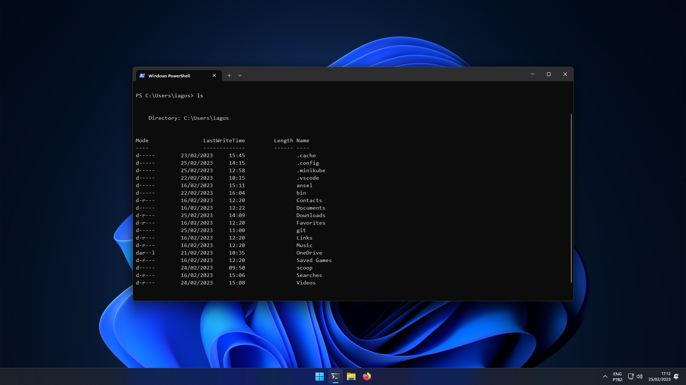
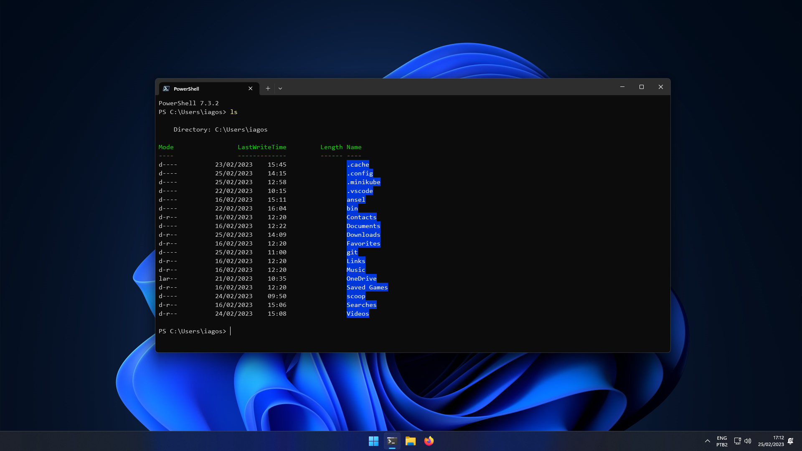
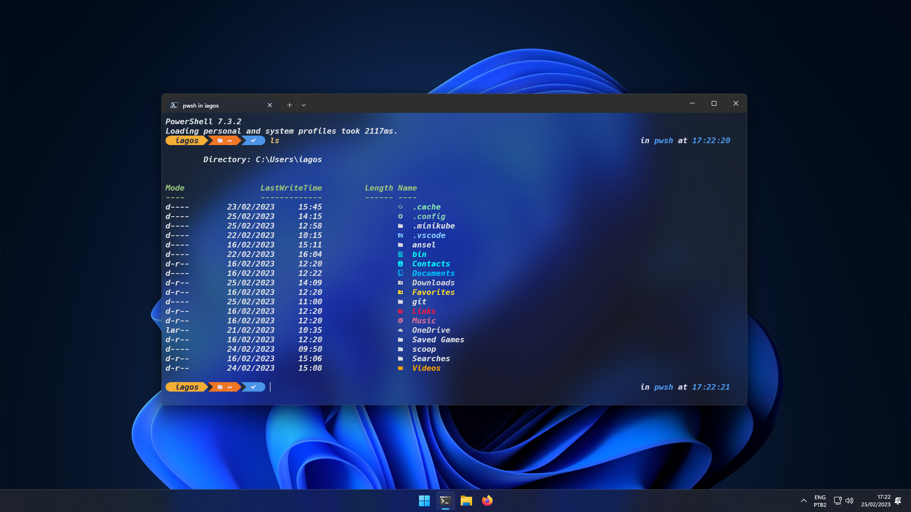

# Things needed to be installed before using the dotfiles
## Content
- Requirements
- Where to put files
- NerdFonts: Hack
- Windows Terminal Configurations
- Scoop (maybe Chocolatey)
- Oh My Posh
- Terminal-Icons
- Directory Jumper - z
- PSReadLine
- Other useful options
- Before and After

---

## Requirements
To use this I use windows terminal with powershell (both installed from MS Store)

Note: it's the PowerShell app not the Windows PowerShell, they're both different applications.

---

## Where to put files
Download all the files into the specific folder before doing any of the other steps
```ruby
$env:USERPROFILE\.config
    powershell
        # posh config
        user_profile.ps1
        # terminal theme if you have one made by yourself or
        # else you can use the default one included with omp
        my.omp.json
```

---

## Font
[Hack.zip](https://github.com/ryanoasis/nerd-fonts/releases/download/v2.3.3/Hack.zip)

This font is required so that your shell can show icons and other things that are included in the oh-my-posh themes and posh-git.

---

## Windows Terminal Configurations
You have to change the following on your windows terminal:
- Set default shell to PowerShell
- Change Font to a Nerdfont of your coice (this will make terminal icons work with no workarounds)
- Change any other settings as you like (I use one half dark theme with acrylic and low to medium opacity)

---

## Scoop
This is a CLI package manager for windows [Scoop SH](https://scoop.sh)

```shell
Set-ExecutionPolicy RemoteSigned -Scope CurrentUser # Optional: Needed to run a remote script the first time
irm get.scoop.sh | iex
```

Then install some useful applications
```shell
scoop install git curl ssh sudo jq neovim nvm
```

---

## Oh My Posh + Posh Git
to make it more appealing for devs also install [posh-git](https://github.com/dahlbyk/posh-git)
```shell
Install-Module posh-git -Scope CurrentUser -Force
```
You can also check the installation [docs](https://ohmyposh.dev/docs/installation/windows) for Oh My Posh


```shell
winget install JanDeDobbeleer.OhMyPosh -s winget
```
### IMPORTANT: remember to close windows terminal after you install.

---

## Configuring new user profile
use a code editor (vscode on my case) to edit the current user and current host config
```shell
code $PROFILE.CurrentUserCurrentHost
```
and then put inside of it the following
```shell
. $env:USERPROFILE\.config\powershell\user_profile.ps1
```
reopen terminal to check for aliases that you have put inside the file to check that it's working properly

---

## Terminal Icons
```shell
Install-Module -Name Terminal-Icons -Repository PSGallery -Force
```

---

## Directory Jumper - z
This will make you jump to folders that you previously navigated to using cd by typing just part of the name of the folder

```shell
Install-Module -Name z -Force
```

---

## PSReadLine
PSReadLine is a autocompletion helper for CLI with power shell

```shell
Install-Module -Name PSReadLine -AllowPrerelease -Scope CurrentUser -Foce -SkipPublisherCheck
```
You can then use some other configurations like:

```shell
Set-PSReadLineOoption -PredictionStyle History
Set-PSReadLineOoption -PredictionViewStyle ListView
```
by using both of thos configuration lines you'll have it search your command history and list the history below your typing line for an easier to view and navigate experience.

---

## Other useful options
Some other packages that you can search to install and try to use for productivity and everything elsea are:
- Fuzzy Finder (fzf and PSFzf) - I don't personally use butI know people like to use those kind of tools so you have the name at your disposal to figure out how to install it.

---

## Before and After
### Before you install PowerShell you have Windows Power Shell


### After you install PowerShell and the above mentioned packages like posh-git etc



### Last but not least, after you make your user profile and change all the appearance settings in the terminal
